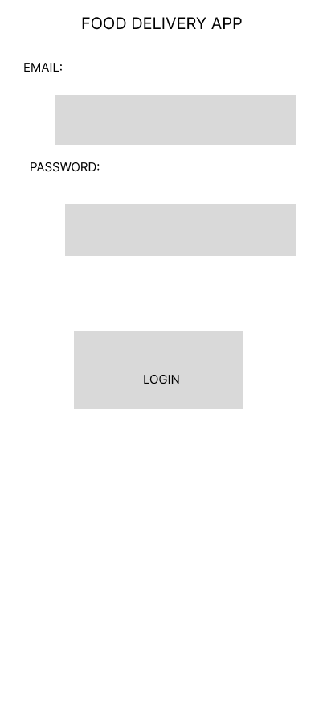
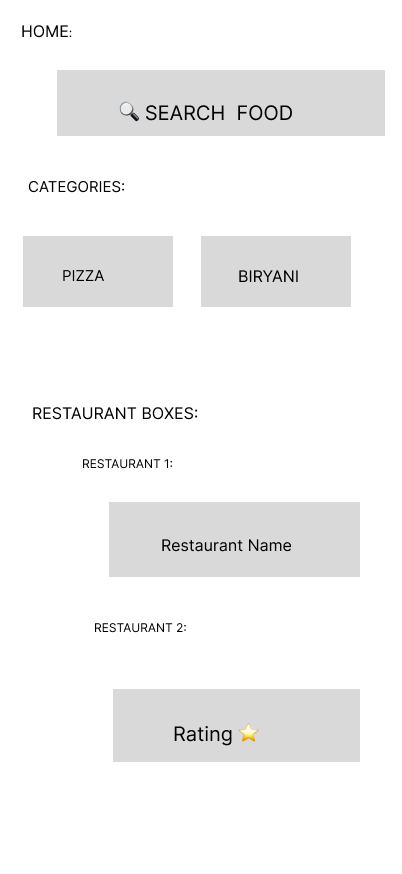
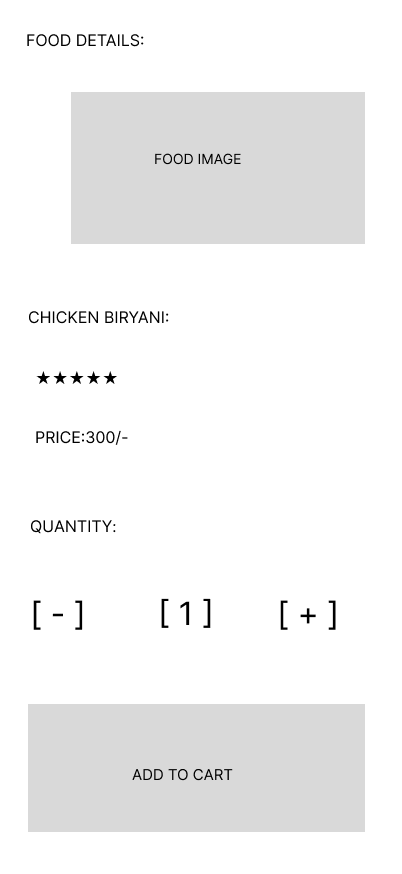
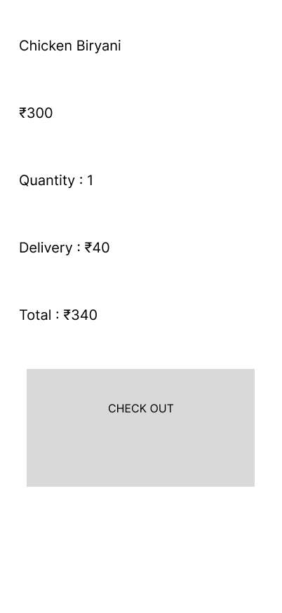
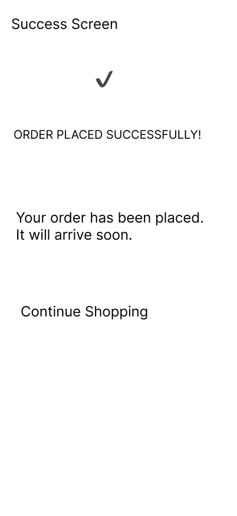

# 🍔 Food Delivery App – Interactive Prototype

## 📌 Project Overview

The Food Delivery App – Interactive Prototype is a UI/UX design project created in Figma. This prototype simulates a complete food ordering experience with interactive navigation between screens.

---

## 🎯 Objective

* Convert wireframes into an interactive prototype.
* Create smooth navigation between screens.
* Simulate real application interactions.
* Improve the design based on user feedback.

---

## 🛠 Tool Used

* Figma

---

## 🔗 Interactive Prototype

**Figma Prototype:**

https://www.figma.com/proto/qfpxJ2BXLrCz61ChvDPdjA/Food-Delivery-App-Wireframe?node-id=0-1&t=8wqnRBHIsqRLa1Bx-1

---

## 📱 Screens

* Login Screen
* Home Screen
* Food Details Screen
* Cart Screen
* Order Success Screen

---

## ✨ Features

* Clickable Interactive Prototype
* Smooth Navigation Flow
* Smart Animate Transitions
* Food Details Page
* Quantity Selector
* Add to Cart Flow
* Order Success Screen
* Continue Shopping Navigation

---

## 🔄 User Flow

Login → Home → Food Details → Cart → Order Success → Home

---

## 🧪 User Testing

The prototype was tested with three users.

### User Tasks

* Login to the application
* Browse food items
* View food details
* Add an item to the cart
* Complete the order

### Feedback Received

* Login button was too far from the input fields.
* Quantity selector was missing.
* Restaurant information needed better organization.
* Cart page required clearer order details.

### Improvements Made

* Moved the Login button closer to the input fields.
* Added a quantity selector.
* Improved the restaurant card layout.
* Added an Order Success screen.
* Improved spacing and navigation.

---

## 📚 Learning Outcomes

* Interactive Prototyping
* Navigation Design
* Smart Animate
* User Testing
* UI/UX Improvements
* Figma Prototyping

---

# 📸 Screenshots

## Login Screen

---

## Home Screen

---

## Food Details Screen

---

## Cart Screen

---

## Order Success Screen

---

## 🎯 Project Outcome

Successfully created an interactive food delivery app prototype with smooth navigation, improved usability, and a user-friendly ordering experience.

---

## 👩‍💻 Created By

**Renuka Garnepudi**

**UI/UX Design Intern**

